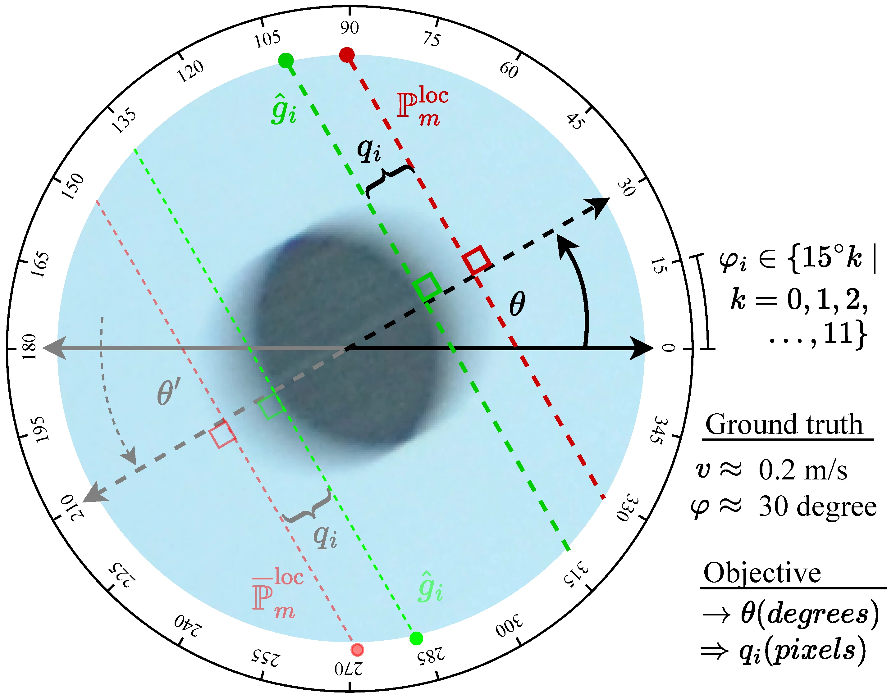
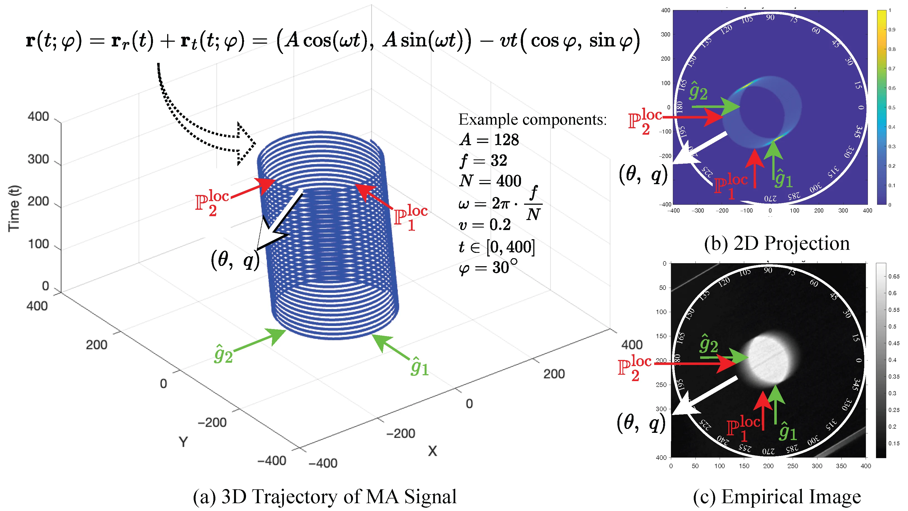

# Movement-Artifact-Direction-Estimation
Empirically captured single-frame image set for benchmarking movement (motion blur) artifact direction estimation and weighted magnitude quantification. Each image contains a single dark circular object translated during exposure over a white background, producing controllable linear blur governed by (orientation pair, velocity).

*Paper1 (MAPE/ROPE/MAQ): https://doi.org/10.3390/s26082360*  
*Repos: https://github.com/nonsakhoo/Movement-Artifact-Quantification*  
*Dataset: https://doi.org/10.34740/kaggle/dsv/15275005*  

*Paper2 (MADE): https://doi.org/10.3390/s25247487*  
*Dataset (minimal): https://doi.org/10.34740/kaggle/dsv/13096999*  

